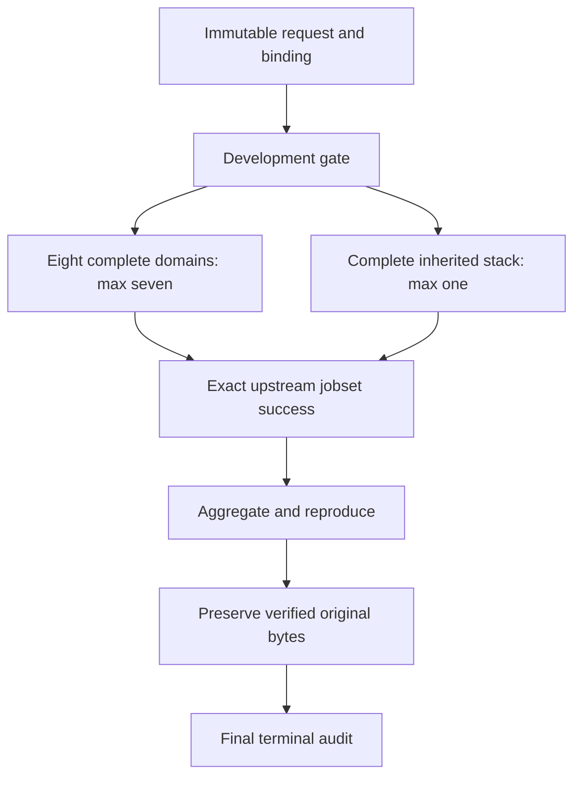

# A2 bounded orchestration design

Status: DESIGN ONLY / UNEXECUTED / UNCERTIFIED ENGINEERING. Start from reviewed immutable engineering source plus certified scientific base 466aa8a6d55a9b21cbf6bfe8a34dd8e6f5c6946f. Preserve repository scientific AGENTS closure for later execution.

## Graph

Route may precede development as in observed audited workflows. All eight domain identities and intervals remain present even though at most seven are concurrent. Inherited reads pinned source/request and does not consume domain outputs in the inspected workflow; this supports scheduling overlap as a proposal. Review actual source closure again before implementation.

Use existing GitHub jobs/artifacts/requests; no new platform, worker service, prepared-universe format or generic scheduler. Development succeeds before any science. Bind exact upstream job IDs when instantiated; matrix names/counts alone cannot authorize readiness. Any missing, duplicated, wrong-attempt or wrong-source job fails the gate. Query every page and exact run attempt. Aggregate checks upstream route/development/eight domains/inherited concluded success, exact artifacts and complete identities. It does not require aggregate's own containing run to have already completed.

If aggregation/preservation are in the campaign run, a separately triggered read-only audit waits for that containing run to be terminal, fetches all jobs/attempt identity, verifies aggregation/preservation and original digests, then emits terminal acceptance. If stages remain separate workflows, terminal audit waits on every exact run in the chain. Neither arrangement may label final closure before every required run is completed/success. The existing whole-run check must be adapted explicitly to upstream-jobset semantics, never disabled without its downstream replacement.

## State and event handling
Immutable key: (campaign_run_id, campaign_attempt, stage), with shard suffix for domain stages. Persist request/input digest and transition revision. States: PENDING → READY → RUNNING → SUCCEEDED, FAILED or INCOMPLETE; successful aggregate → preserved → terminal audited are different stages. Nonterminal timeouts become INCOMPLETE. Every failure includes identity, source hashes, timestamps, typed cause and preserved checkpoint/artifact identifiers. First scientific failure is immutable.

Duplicate event with matching key/digest returns the recorded receipt; conflicting digest rejects. Late events cannot overwrite terminal state. A transport retry may resume only after readback reconciles a known no-commit outcome, with bounded count/deadline and same immutable data. Unknown publish outcome is not retried blindly. Assertion/scientific failures never rerun automatically. Human-authorized new attempts remain separate identities and preserve failed receipts. The state schema is structural; cross-field and monotonic invariants require semantic validation.

## Artifact and privileged publication boundary
Aggregate operates read-only and preserves original ZIP bytes, API digest/length, source bindings, complete nonempty deterministic manifest and exact membership. Untrusted artifacts are data: safe extraction refuses absolute/traversal paths, symlink/hardlink entries, collisions, duplicate normalized names and unbounded decompression; budgets are fixed before launch. No imported/executed artifact source, action metadata, hooks or commands.

Publication executes an approved helper from pinned trusted checkout, not a helper inside downloaded data. Validate helper bytes, workflow/event/checkout SHA, parent/request and intended aggregate run/attempt/head. Credentials are absent from science and restricted to preservation. Allow only the exact evidence/validated/run-<ID>-attempt-<N>/ prefix; prohibit workflow/source mutation and artifact-selected destinations. Require a fresh isolated evidence branch with atomic absent-ref lease; existing refs reject. Verify archive reconstruction, digests and changed-file membership before write, and read back exact committed blobs afterward. Preserve publication failure/uncertain receipts without success claims.

## Resource and scheduling boundary
At most eight active scientific jobs in this controller, at most seven domains and one inherited. Duplicate deliveries cannot consume an additional permit. Stage gates hold permits only while jobs run; aggregation and preservation start after science ends. Preserve existing per-job memory/time/dependency pins. Controller deadline/event cap and bounded transport retries must be prospectively frozen; missing values block launch. A2 keeps the eight scientific intervals and does not repartition. Fair scheduling of the eighth shard is explicit; no assumed speedup from the three historical timings. A3 is deferred.

